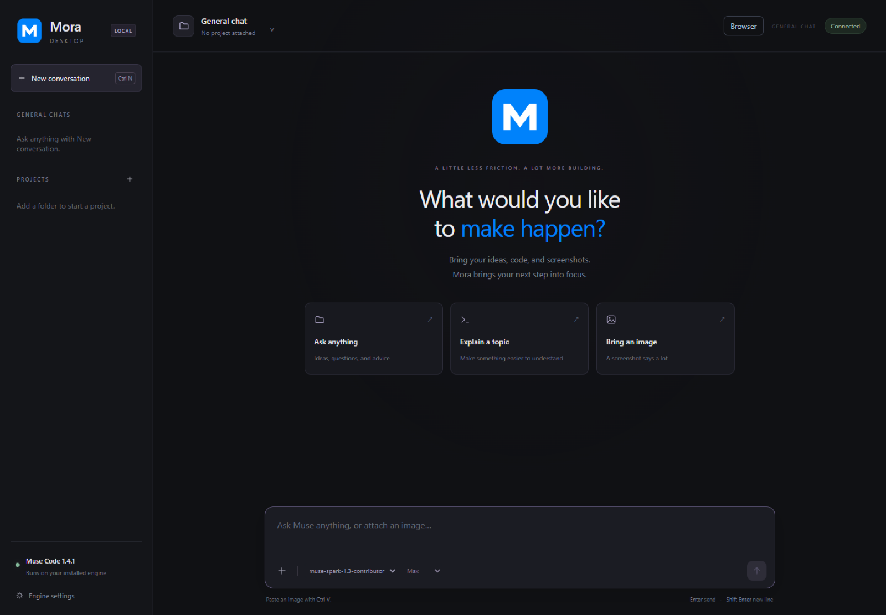
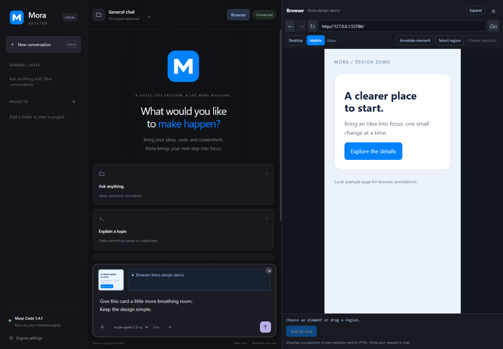
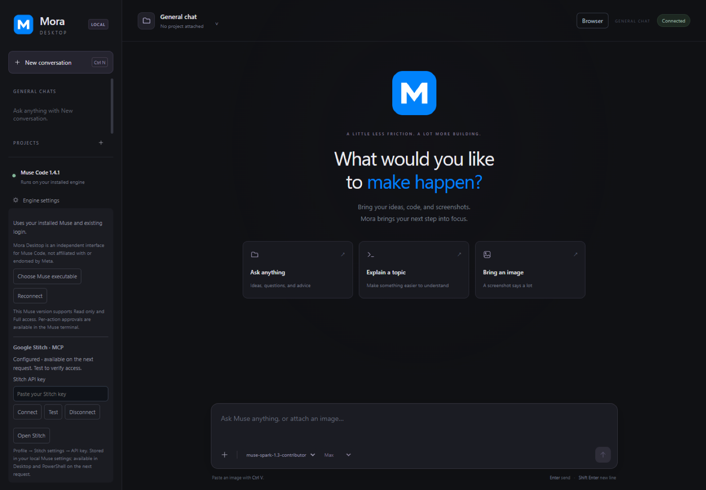

# Mora Desktop

**A Windows desktop workspace for the Muse coding engine.**

Chat with your coding engine, work with local projects, inspect live file changes, and
send selected browser designs to Muse with a cropped screenshot and HTML context.

[Screenshots](#screenshots) · [Features](#features) · [Installation](#installation) · [Technology stack](#technology-stack) ·
[Build from source](#build-from-source) · [Privacy](#privacy-and-local-data) ·
[License & attribution](#license-and-attribution)

Mora Desktop is an independent desktop interface for Muse Code, with a
Codex-inspired workflow. It is not affiliated with or endorsed by Meta or OpenAI.
It uses your separately installed Muse engine and that engine's existing login.
Mora Desktop uses its own name and original M icon.

## Screenshots

Captured from Mora Desktop using an isolated profile and a local demo page.
No personal chats, API keys, or private project data are shown.

### Desktop workspace



### Browser annotations

Select a page element, preview its cropped screenshot, and attach its HTML context to the main chat.
The example below uses the Mobile preview.



### Engine settings

Choose your Muse executable, reconnect the engine, and configure your own Google Stitch MCP connection.



## Features

| Feature | What it does |
| --- | --- |
| Chat workspace | Saved drafts, safe Markdown headings/lists/tables, copyable code, images and automatic text direction. |
| Image attachments | Pick or paste PNG, JPEG and WebP images into the main chat. |
| Muse sign-in | Uses the existing engine login or opens native Meta browser sign-in, with cancellation and clear account status. |
| Run my app | Starts your configured local app, waits for readiness and opens its preview; supports Stop/Restart. |
| Test my app | Runs configured checks with actual results, plus local page-load checking and one explicit repair/recheck. |
| AI Tester (experimental) | Tests a running local app with native Spark, retains assertions and screenshots, reproduces findings, and repairs explicitly selected confirmed issues. |
| Checkpoints | Saves source before changes; previews selective restore, protects newer edits and retains recovery checkpoints. |
| Projects & general chat | Group conversations under local project folders, or ask general questions without attaching a project. |
| Persistent conversations | Restore chats across restarts and upgrades; remove a conversation explicitly from the sidebar. |
| Live activity | Show current work, public progress messages, actual commands, tool arguments, output and exit codes supplied by Muse. |
| Live file reviews | Update a changed-file badge and added/removed line counts during edits; open a colored diff preview. |
| Request queue | Durable follow-ups with images, edit/remove controls and explicit pause/resume; Stop preserves pending work. |
| Execution controls | Read only for inspection, Full access for project operations, and Stop for the active request. |
| Integrated browser | Browse websites and local development servers in a Chromium panel with Desktop/Mobile previews and an expanded view. |
| Design annotations | Numbered selections with editable notes, source URL and bounded HTML; compare before/after screenshots of the same preview. |
| Work speed | Quick, Balanced and Thorough use supported efforts on your selected model; explicit effort controls stay available. |
| Google Stitch MCP | Connect, test and disconnect your own Stitch account; use design tools through Muse's native MCP integration. |
| Image previews | Display supported Stitch image links in chat, enlarge them, or copy the original link. |
| Windows integration | Per-user Setup, Start/Search shortcut, single-instance activation and minutes/seconds activity timing. |

The concise agent-facing feature reference is [docs/features.md](docs/features.md).

### Conversation context

Each conversation keeps its own Muse session and context. Conversations inside a
project can read the same project files, but do not automatically read each other's
messages. Record shared decisions in project documentation when another chat needs
to continue the work. General chats run in a private workspace with Read only mode.

### Live work and completion

Tool cards report the engine's actual activity. The file badge updates while files
change, and saved reviews remain attached to their conversation. Reviews show what
changed; they do not provide accept/revert controls. Large files or partial snapshots
are labelled rather than presented as a complete review.

A reply can appear before the engine finishes its final work. **Reply ready · finishing
final checks** reflects that state. Follow-up messages wait in the queue until native
completion. Stop terminates the active engine process tree and pauses queued messages;
file edits already completed remain on disk. Pending messages and draft images survive
restarts. Recovered queues stay paused until Resume, and interrupted admitted requests
are never sent again automatically. Completion summaries report observable outcomes;
screenshots and generated replies do not establish that tests passed.

## Installation

### Requirements

| Requirement | Installed app | Source development |
| --- | --- | --- |
| Windows 10/11 x64 | Required | Required for Windows packaging and desktop checks |
| Muse engine | Installed and signed in on that PC | Required for live engine checks |
| Git for Windows | Required for full diff previews | Required for repository work and diff tests |
| Node.js 24+ | Required on PATH for Run/Test; desktop UI runtime is bundled | Required on PATH |
| Package manager | npm, pnpm or yarn on PATH as declared by your project | pnpm 11.19.0 on PATH |
| Stitch account/key | Only for Stitch features | Only for live Stitch features |

Engine compatibility has been tested with Muse Code **1.4.1**. The engine and access
to its provider must be obtained separately; this repository does not bundle them.

### Install a release

1. Install Muse Code on your Windows account. Sign in with Muse or use Mora’s browser sign-in.
2. Open [Releases](https://github.com/uchihamazen/Muse-Desktop/releases) and, when an
   installer is published, download `Mora-Desktop-Setup-<version>-x64.exe`.
3. Run Setup and choose an installation folder. Installation is for the current user
   and creates **Mora Desktop** in Start/Windows Search.
4. Open the app. It discovers Muse under `%LOCALAPPDATA%\Programs\muse`; for another
   location, select **Engine settings → Choose Muse executable**.
5. Use **New project** for a starter app, **Open/Add project** for an existing folder, or start a general conversation.

Setup installs the complete Electron package beside the EXE. Keep those resources
together. The current package is unsigned; a trusted signing certificate is not
included, and antivirus acceptance is not guaranteed. Setup does not change Windows
security settings. Upgrades and uninstall preserve the local chat profile.

## Using the app

### Build, run, check and restore

1. Create or open a project. The starter runs without additional packages; existing projects need their dependencies installed.
2. Choose **Full access** when you want Muse to edit files. A complete source checkpoint is saved before each request.
3. Select **Run my app** to see the local app in the preview. Use browser annotations to describe changes.
4. Select **Test my app** for configured checks and page loading. Expand **Show results** for outputs. Interactions still need suitable project tests.
5. Select **Fix failures** for one Muse repair and one recheck, or stop the app and open **Checkpoints → Review restore** to select files to undo.

### Website tester (experimental)

Select **Website tester**, or enter `/tester` or `/tester https://example.com <objective>`.
No project folder or application source is required. Open the website, sign in manually
if needed, choose a workflow, page or website scope, then select **Start checking**.
Mora uses the existing native model connection and a dedicated Playwright browser.
Review each exact short case with **Allow this case**, or **Allow once** for a discovery
action. Decline, take over or update the testing focus at any time. Set operation/time
limits in **Setup**, using Quick, Standard or Intensive budgets or custom values.
Use **Tests** and **Findings** to filter results, **Explore** to focus on discovered
controls, and **Evidence** to inspect actions and masked screenshots. Run controls
remain visible while you browse results. Clicks are recorded separately from assertions.
The saved map records observed pages, controls, states and transitions, with normal
workflows before grounded boundary, input, transition and timing variations. Locally
executed sequences avoid a model round trip between rapid inputs.

Cases cite supplied requirements, visible rules or exposed input constraints. Unsupported
expectations need clarification; automation failures are blocked. A failed assertion is
an observed failure until the unchanged case fails again from verified starting conditions
with fresh **Allow replay** permission. Confidence and severity are separate. Optional
axe accessibility scans include violations and checks needing manual review; they do
not establish complete accessibility conformance.

Website scope separates navigation origins from supporting resource origins. Add required
login/API/CDN origins explicitly. Service workers and downloads are disabled; blocked
dependencies and untested behavior remain visible. Use test accounts and designated data:
browser isolation does not undo changes made to the live service. Save a login only when
needed; it is encrypted by the operating system and separated by site and account label.
Page text is sent to the connected provider. Password/contact fields and common secrets
are filtered, but arbitrary personal content is not guaranteed to be recognized; avoid
sensitive pages. Screenshots stay local with input fields masked.

**Reports** preserves checks and evidence across restarts. **Stop and close browser**
cancels work and closes only the owned browser. Take over preserves the current page
unless an action is already pending in the browser: then Mora closes it to cancel the
action and records an uncertain outcome. Reopen the site before continuing in that case.
Starting a fresh check re-observes the page. Discovery is bounded and describes observed
coverage only. Other roles need supplied logins; canvas and drag-and-drop are unsupported.
Choose a discovered feature, or use **Select in browser** to pick a control (click or
focus it and press Enter). **Record workflow** follows up to eight deliberate actions;
finish recording and provide the expected outcome before using the demonstration.
Demonstrations guide a fresh plan and never grant execution permission. Update paths,
scope and budgets with **Update testing focus**; older pending approvals are cancelled.

**Reopen saved report** opens a fresh browser while preserving prior evidence. Coverage
separates discovered controls, exercised controls and controls with outcome assertions.
**Export HTML** and **Export JSON** use the operating-system save dialog. Masked local
screenshots are optional; ordinary exports omit login storage and raw runtime traces.
Review content before sharing because private text outside recognized fields may remain.

The repeated acceptance harness independently verifies eight healthy/faulty counterparts
before three fresh autonomous trials per variant. Run `node scripts/website-acceptance.js`
after preparing the packaged browser; reports and every trial stay under `artifacts/`.
Use `--oracles-only` to validate fixtures without model calls. The release remains
experimental: broad discovery can leave workflows unchecked or unable to restore their
starting state. Completed runs do not establish whole-site reliability.
Website testing has no source-editing or repair capability.

### Project tester (experimental)

Run your app, open **Project tester**, describe the behavior you expect, and select
**Start report**. `/project-tester report <requirements>` starts the same workflow.
Mora supplies your request and the project's README to native Spark, then executes
bounded browser decisions in a separate visible Chromium window. Reports and
screenshots remain in your local profile. **Saved reports** restores them after a
restart; **Resume unfinished cases** is explicit and requires unchanged source and
the same app address. Each run allows up to 100 browser actions and 15 minutes;
a pending native decision can take up to 90 seconds to finish or time out.

Cases distinguish passed recorded assertions, confirmed failures, suspected failures,
blocked work and untested coverage. A confirmed failure means that the same assertion
failed again on replay and passed a separate expectation review against requirements
and observed setup. The report retains that rationale; it still needs human review. This is an
experimental assistant, not a complete test suite or a release-readiness verdict.
Browser storage resets between cases. Server data does not reset, so use disposable
test data. Testing is restricted to the running localhost origin; external resources,
popups, downloads, embedded cross-origin apps and non-HTML document navigation are
blocked. Canvas interactions and drag-and-drop are not supported.

For repair, choose **Full access**, select confirmed issues, and use **Repair selected
issues**, or send `/project-tester solver BUG-001` (up to five IDs) or `/project-tester solver all confirmed`.
Mora reproduces the original case before allowing edits, saves a source checkpoint,
runs one native repair, restarts the app and replays unchanged assertions plus up to
three previously passing cases and configured checks. A changed recognized test,
requirement, configuration or dependency file prevents a verified result.
Common test directories, snapshots and configured check entry files are protected;
unconventional indirect check inputs may require manual review. Missing checks remain
unverified. Source edits stay available for review, including after Stop; stop the
app and use **Checkpoints** to inspect or restore them. Source recovery does not
reset application data. Reopened reports whose source no longer matches are marked historical/stale.

Tester requests use an isolated native configuration with skills and workflow
reminders disabled. Report mode exposes no native file or shell tools. The current
Muse login is temporarily copied into that private runtime and removed on normal
cleanup; an unexpected process or machine crash can leave temporary runtime files.
Your global Muse settings are preserved. Requirements, observations and selected
screenshots go through your existing Muse provider connection.

Run/Test currently support Node projects with package.json scripts and Node/package manager on PATH. Checkpoints exclude secrets, generated files and oversized/linked source; they preserve Git history and unrelated later edits. They are source recovery, rather than whole-project backups.

### Chat and projects

- **Enter** sends; **Shift+Enter** inserts a line; **Ctrl+N** starts a general chat.
- Use **+** or **Ctrl+V** to attach images. Limits: 20 images, 10 MiB per image,
  and 20 MiB total per message.
- Choose a model and reasoning effort from the engine-provided choices.
- In a project, select **Read only** to inspect or **Full access · YOLO** to allow
  edits and commands under your Windows account's permissions.
- Hover a conversation's delete control: the first click arms it, the second deletes
  the conversation and its native history. There is no built-in undo.
- The queue retains up to 10 pending messages, including images. Edit or remove a
  pending message, pause/resume the queue, or clear it separately from Stop.

### Browser annotations

1. Open **Browser** and enter an HTTP/HTTPS URL or local address such as `localhost:3000`.
2. Choose **Desktop** or **Mobile**, and **Expand** for more room.
3. Use **Annotate element** to click an element, or **Select region** to drag an area.
4. Click **Add to chat**. Muse receives a cropped screenshot of the visible selection
   with bounded HTML, URL and computed styles.
5. Add an editable note to the numbered selection card, select more areas if needed,
   and write your overall request in the main composer.

Use **Capture before**, make a change, then **Compare after** to compare the same
page, device, viewport and scroll position. Both images show their capture times.
This is a visual comparison; it does not verify functionality or tests.

Desktop fits a minimum **1280px CSS viewport**; Mobile previews a **390px viewport**.
Mobile changes responsive width, without emulating a phone's hardware, touch or user agent.
Navigation, scrolling, resizing and device changes invalidate the selection. Select again
if the page changes. Annotation HTML omits scripts, event handlers and form values,
and is limited to 24,000 characters. Frames are selected as outer elements.

The browser uses a persistent partition for cookies and login state. Web pages run
sandboxed without Node or the Muse bridge; downloads, native permissions and non-web
navigation schemes are denied.

### Google Stitch

Open **Engine settings → Google Stitch · MCP**, paste your own key and use **Test**
or **Connect**. Test checks a pasted key without saving it; Connect verifies access
before storing it in your local Muse settings. Muse discovers the native MCP tools
on the next request, including from its terminal.

Stitch generation depends on the tools available to your account, authentication and
quota. Supported Stitch image links render in chat and open in a larger viewer. A
failed or expired image URL offers a copy-link fallback. There is no separate model
or image-generation service bundled in the desktop app.

## Technology stack

| Layer | Technology | Role |
| --- | --- | --- |
| Desktop shell | Electron **44.5.0** | Native window, isolated preload/IPC, clipboard, dialogs and embedded browser views. |
| Browser/rendering | Chromium supplied by Electron | App rendering and sandboxed web previews; DevTools Protocol handles viewport metrics and cropped screenshots. |
| Runtime | Node.js; **24+** for development | Child processes, filesystem operations, HTTP requests and application orchestration. |
| Frontend | JavaScript ES modules, HTML5, CSS | Chat UI, responsive layout, activity cards, file reviews and image viewers. |
| Engine integration | Muse CLI, JSON Lines and JSON-RPC | `exec --json --session-id` runs turns; native logs restore context; `serve` discovers models. |
| Design integration | MCP over Streamable HTTP | Google Stitch tools configured through the native engine settings. |
| Local persistence | JSON files and Muse JSONL logs | Atomic conversation indexes, separate draft/queue work files, backups and per-conversation reviews. |
| File review | Git CLI and Node filesystem watchers | Baseline comparisons, ignore-aware discovery and live diff updates. |
| Tests | Node.js test runner and Playwright **1.62.1** | Deterministic unit/lifecycle checks and browser/Electron smoke checks. |
| Package management | pnpm **11.19.0** | Pinned dependencies and frozen-lockfile installs. |
| Windows packaging | electron-builder **26.15.3**, NSIS | Per-user x64 Setup and staged unpacked builds. |
| Automation | GitHub Actions on Windows | Tests, installer builds and SHA-256 artifact checksums. |

Dependency versions are pinned in [package.json](package.json) and
[pnpm-lock.yaml](pnpm-lock.yaml).

## Build from source

Install Node.js 24+, pnpm 11.19.0 and Git for Windows, then:

```powershell
git clone https://github.com/uchihamazen/Muse-Desktop.git
Set-Location Muse-Desktop
pnpm install --frozen-lockfile
pnpm test
pnpm start
```

Build the Windows installer:

```powershell
pnpm run build
```

Output: `artifacts/release/Mora-Desktop-Setup-<version>-x64.exe`.
The build includes the desktop runtime and license notices. Output is staged outside
the local installed `dist` package. `powershell -File scripts/source-archive.ps1` creates
a clean versioned source ZIP and SHA-256 checksum from reviewed public files. It
refuses to overwrite an existing archive; inspect file membership before uploading.

For an unpacked development build:

```powershell
pnpm run build:desktop
# After verification, close the old app and use an external PowerShell:
& .\scripts\install-desktop.ps1
```

The local deployment helper installs `artifacts/self-build/win-unpacked` into `dist`
as `Mora Desktop.exe`. Update any old manual development shortcut to that renamed
EXE. Wait for a successful build exit before deployment.
Do not overwrite a running EXE or install a portable extraction wrapper in its place.
Quitting Mora Desktop stops its own engine process tree, so replacement must happen
from an external terminal. End users launch the Setup-created Start shortcut directly.

### GitHub Actions and releases

The [Windows installer workflow](.github/workflows/windows-build.yml) runs manually
from **Actions → Windows installer → Run workflow**, or on a pushed `v*` tag. It
installs locked dependencies, runs Node tests and builds Setup plus a SHA-256 checksum.
Download the resulting artifact and attach those files to a GitHub Release. The
workflow does not publish a Release automatically or require a Muse account/API key.

## Privacy and local data

Each Windows account stores preferences and the conversation index in
`%APPDATA%\Muse Desktop`. This original profile location is retained so the Mora
rebrand preserves saved chats and settings. Native Muse logs retain message context;
the embedded browser retains its own cookies locally. Local storage does not imply offline AI:
messages, images and tool context are sent through the selected engine/provider and
are subject to that provider's terms.

Stitch credentials live in the native local Muse settings, outside project files.
They are not displayed in chat/state/error output, and this project does not claim
that the engine's JSON settings file is an encrypted credential vault.

Public source packages exclude chat/session logs, profiles, backups, API keys,
machine-specific settings, internal development records and the original development
Git history. Test credentials in fixtures are synthetic. Upload code and public
documentation; attach installers/checksums as Release assets. Preserve real credentials
and user profiles locally.

`scripts/clean-local-builds.ps1 -WhatIf` previews removal of obsolete local build
copies. It preserves the installed package, release files, dependencies and chat/profile backups.

## Optional Ponytail / Superpowers workflows

The [workflow-defaults plugin](muse-plugins/workflow-defaults/README.md) loads startup
instructions into Muse sessions. It requires Node on PATH, an approved native hook,
and separately installed full Superpowers/Ponytail skill libraries on each machine.
It is not automatically installed by Setup. Project instructions and direct user
requests remain authoritative. Its original license notices are retained.

## Testing and troubleshooting

```powershell
pnpm test
node scripts/frontend-smoke.js
node scripts/browser-smoke.js
node scripts/ui-smoke.js
node scripts/work-smoke.js
node scripts/journey-smoke.js
node scripts/performance-smoke.js
```

Frontend/performance smoke uses Microsoft Edge; desktop smoke checks use temporary profiles.
Pass a staged EXE path to desktop smoke scripts to check the packaged application.
Performance reports measure local fixtures, rather than provider response speed.
Live engine checks require a signed-in Muse installation. Adding `--send` to supported
smoke scripts uses the provider account. Reports and screenshots stay in ignored `artifacts`.

| Symptom | What to check |
| --- | --- |
| Engine is disconnected | Confirm Muse is installed and signed in; select its executable and Reconnect. |
| Chat appears restored but cannot send | A native log is missing. Cached text can be displayed, but cannot recreate engine context; restore the native log or start a new chat. |
| Reply is visible while the request remains busy | The engine may still be finishing native work; follow the activity cards or queue a follow-up. |
| Diff is unavailable or incomplete | Check Git installation and the review's partial/large-file limits. |
| Browser selection cannot attach | Wait for loading to finish and reselect after navigation, scrolling or resizing. |
| Stitch tools or images fail | Test your account/key, check quota and confirm the image URL remains accessible. |

Muse 1.4.1's headless interface does not support working streamed turns/history via
the tested MSP methods or interactive per-tool approval dialogs. Turns therefore use
the working CLI/native-log path; granular approvals remain in the Muse terminal.
Windows child processes receive `RUST_MIN_STACK=33554432` to address the tested runtime's
thread-stack issue, without modifying global environment settings.

## Contributing

Fork the repository, make a focused change, update [docs/features.md](docs/features.md),
and run checks appropriate to the change. Keep feature entries concise. Include no
real account keys, chat histories or personal screenshots. Check [AGENTS.md](AGENTS.md)
for build and publication guidance. Rebuild and verify the installer when application
behavior or packaged files change.

## Contributors

- [@Qorsham](https://github.com/Qorsham) — Original idea and contributions to performance optimization.

## License and attribution

Original project code and the Mora icon are available under the [MIT License](LICENSE),
allowing use, modification and redistribution subject to its notice requirements.

Third-party software, artwork and services remain subject to their respective
licenses and terms. Third-party names and trademarks belong to their respective
owners; this project's MIT license does not grant permission to use those marks.

Mora Desktop is independently developed and is not affiliated with, sponsored by,
or endorsed by Meta or OpenAI.

See [THIRD_PARTY_NOTICES.md](THIRD_PARTY_NOTICES.md),
[Meta's brand guidelines](https://www.meta.com/brand/resources/meta/company-brand/),
[OpenAI's brand guidelines](https://openai.com/brand/), and
[asset attribution](src/assets/README.md).
